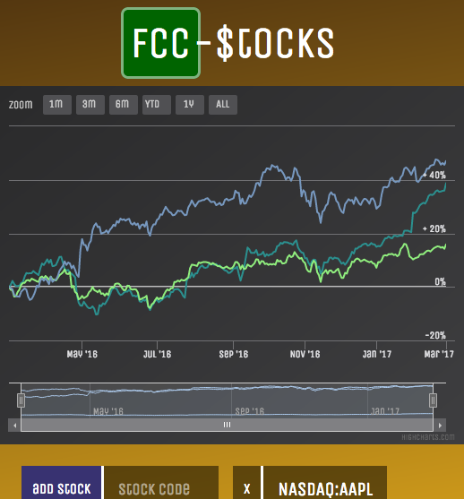

# fcc-stocks
this webapp uses google-finance to keep track of stock value history for up to 1 year ago.

the code uses uws websockets, and sends bson data over the wire, given a better format for numerical data. events suchas 'add', 'set', 'remove' stock, cause the client to update appropiatly. the client uses highcharts and vuejs

how it works is that everyone sees the same live screen, when stocks are added from different browsers.
